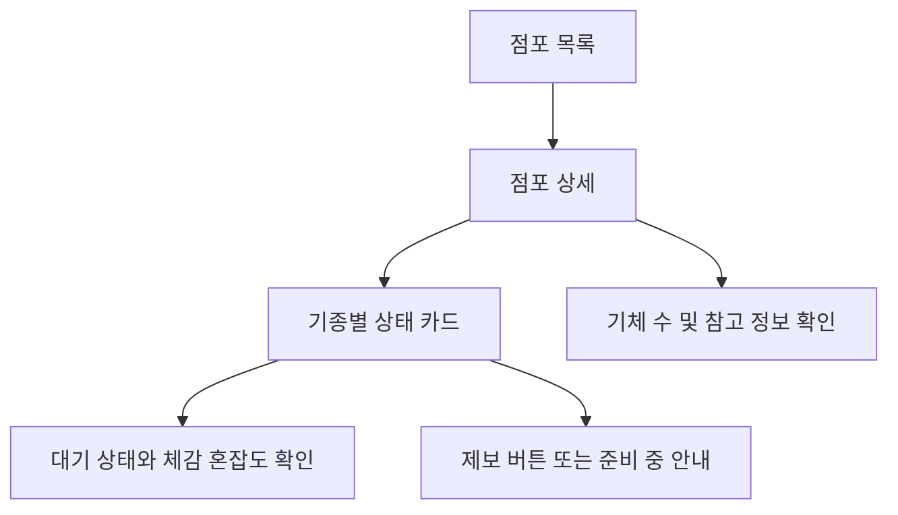

# 알파테스트 화면 흐름과 표시 규칙

## 1. 목적

이 문서는 리듬레이더 알파테스트에서 이용자가 보게 될 공개 화면의 정보 구조와 표시 규칙을 정리합니다. 현재 단계에서는 화면 설계 문서만 작성하며, React/Next.js 화면, 로그인, DB, 백엔드, 실제 제보 기능은 구현하지 않습니다.

화면은 [../src/data/alphaStores.ts](../src/data/alphaStores.ts)의 정적 데이터 구조를 기준으로 설계합니다. 체감 혼잡도 문구는 [crowd-level-policy.md](crowd-level-policy.md)를 따릅니다.

## 2. 화면 목표

- 방문 전 점포와 기종별 상태를 빠르게 훑어볼 수 있게 합니다.
- 정확한 대기 인원이나 대기 시간을 예측하지 않습니다.
- 검수되지 않은 기종과 기체 수는 추정해서 보여주지 않습니다.
- 신버전 온라인 추적 대상이 아닌 기체는 참고 정보로만 표시하고 혼잡도 계산에는 넣지 않습니다.
- 기체의 신구 여부는 추적 포함 기준이 아니지만, 이용 수요가 다르면 신기체/구기체 그룹을 분리해 표시합니다.
- 알파 단계의 미완성 기능은 숨기거나 `준비 중`으로 명확히 표시합니다.

## 3. 기본 흐름



알파 초기 정적 화면에서는 `점포 목록`과 `점포 상세`를 우선 설계 대상으로 둡니다. 로그인 제보 화면, 신고 화면, 관리자 검수 화면, 사진 제보 화면은 후속 구현 범위로 두고 이 문서에서는 진입 위치와 비활성 표시만 정의합니다.

## 4. 공통 표시 규칙

| 항목 | 표시 규칙 |
| --- | --- |
| 점포명 | `AlphaStore.name`을 그대로 표시 |
| 지역 | `region`과 `area`를 함께 표시 |
| 점포 상태 | `PENDING_VERIFICATION`이면 `기종 검수 중`으로 표시 |
| 점포 상태 | `PLANNED_ALPHA_2`이면 `알파 2차 예정`으로 표시 |
| 점포 비고 | `notes`가 있으면 보조 문구로 표시 |
| 기종 목록 | `games`가 비어 있으면 `아직 검수된 기종이 없습니다` 표시 |
| 새로고침 안내 | 정적 데이터 단계에서는 `실시간 정보가 아닙니다` 안내 표시 |

상태 문구는 이용자가 데이터의 확정 여부를 오해하지 않도록 보수적으로 표시합니다. 검수 전 값은 `0`이나 `없음`으로 대체하지 않고 `검수 전`, `정보 부족`, `확인 필요` 중 하나로 표시합니다.

## 5. 점포 목록 화면

### 목적

알파 1차 대상 점포 5곳을 한눈에 보여주고, 이용자가 관심 있는 점포 상세로 이동할 수 있게 합니다. 알파 2차 예정 점포는 기본 목록과 분리하거나 예정 배지를 붙여 표시합니다.

### 카드 구성

| 영역 | 표시 내용 |
| --- | --- |
| 상단 | 점포명, 지역/area |
| 상태 배지 | `기종 검수 중`, `운영 중`, `비공개` 등 점포 상태 |
| 요약 | 검수된 기종 수, 최근 제보가 있는 기종 수 또는 정보 부족 안내 |
| 비고 | 점포 notes 또는 검수 필요 안내 |
| 이동 | 상세 보기 링크 또는 카드 전체 클릭 |

### 목록 상태

| 데이터 상태 | 화면 표시 |
| --- | --- |
| `games.length === 0` | `기종 검수 중`과 `아직 표시할 기종이 없습니다` |
| 검수된 기종이 있으나 모두 `UNKNOWN` | `정보 부족` |
| 하나 이상 계산 가능한 기종 있음 | 최근 제보가 있는 주요 기종 수 또는 기종 수 요약 |
| 점포 `status`가 `PLANNED_ALPHA_2` | `알파 2차 예정`으로 표시하고 혼잡도 요약은 숨김 |
| 점포 `status`가 `HIDDEN` | 공개 목록에서 제외 |

알파 초기에는 알파 1차 점포 대부분이 `PENDING_VERIFICATION`일 수 있으므로, 목록 화면은 빈 화면처럼 보이지 않게 점포명과 검수 안내를 우선 노출합니다. 점포 전체 혼잡도는 알파 범위에서 계산하지 않습니다.

## 6. 점포 상세 화면

### 목적

선택한 점포의 기종별 대기 상태, 체감 혼잡도, 기체 수 검수 정보를 확인하게 합니다.

### 상단 영역

| 영역 | 표시 내용 |
| --- | --- |
| 점포명 | `name` |
| 위치 | `region`, `area` |
| 점포 상태 | `PENDING_VERIFICATION`이면 `알파 대상 / 기종 검수 중` |
| 점포 상태 | `PLANNED_ALPHA_2`이면 `알파 2차 예정` |
| 안내 | `notes` |

### 기종 카드

검수된 `games`가 있을 때 기종마다 다음 정보를 표시합니다.

| 영역 | 표시 내용 |
| --- | --- |
| 기종명 | `game.title` |
| 체감 혼잡도 | `queueLevel`과 `activeTrackedMachineCount`로 계산한 표시 문구 |
| 대기 상태 | `QUEUE_LEVEL_LABELS[queueLevel]` |
| 최신 온라인 가동 | `activeTrackedMachineCount` |
| 추적 대상 | `trackedMachineCount` |
| 전체 기체 | `totalMachineCount`, 보조 정보 |
| 추적 제외 | `untrackedMachineCount`, 보조 정보 |
| 기체/버전 그룹 | `machineGroups`의 기체 모델, 가동 버전, 추적 여부, 그룹별 대기 상태 |
| 마지막 제보 | `lastReportedAt` 또는 `최근 제보 없음` |
| 마지막 검수 | `lastVerifiedAt` 또는 `검수 전` |

`untrackedMachineCount`가 `1` 이상이면 `신버전 온라인 추적 대상이 아닌 기체는 대기열 계산에서 제외됩니다` 안내를 표시합니다. 사운드볼텍스처럼 발키리 모델은 최신 버전, 구기체는 이전 버전으로 나뉘는 경우 `machineGroups`에 기체 모델과 소프트웨어/서비스 버전을 함께 표시합니다. beatmania IIDX처럼 신기체와 구기체가 모두 같은 신버전을 가동하면 둘 다 추적 대상이지만, 수요 차이가 있으면 그룹을 분리해 표시합니다. 기타도라처럼 아레나 모델과 구기체 사이에 마이너 버전 차이가 있으면 알파에서는 아레나 모델만 추적 대상이고 구기체는 참고 정보로 표시합니다. 팝픈뮤직처럼 신기체에만 신버전이 선행 적용되는 기간에는 신버전 신기체 그룹만 추적 대상이고 이전 버전 구기체는 참고 정보로 표시합니다.

### 기종 정렬

점포 상세의 기종 카드는 [crowd-level-policy.md](crowd-level-policy.md)의 수요 및 표시 우선순위 등급을 따릅니다.

| 정렬 등급 | 표시 규칙 |
| --- | --- |
| `PINNED_TOP` | 최상단 고정 |
| `HIGH` | 최상단 아래 |
| `MEDIUM` | 기본 위치 |
| `LOWER_MEDIUM` | 기본보다 약간 아래 |
| `MEDIUM_LOW` | 기본보다 아래 |
| `PINNED_BOTTOM` | 최하단 고정 |

같은 등급 안에서는 정적 데이터 입력 순서를 유지합니다. beatmania IIDX처럼 기체 그룹별 수요가 다르면 기종 카드 안에서 라이트닝 모델을 디럭스 모델보다 먼저 표시할 수 있습니다.

### 검수 전 상세

`games`가 비어 있으면 기종 카드 대신 다음 안내를 표시합니다.

```text
아직 검수된 기종이 없습니다.
알파 시작 전 관리자 검수 후 최신 온라인 기체와 대기 상태를 표시합니다.
```

이 상태에서는 혼잡도, 대기 상태, 기체 수를 추정 표시하지 않습니다.

## 7. 체감 혼잡도 표시 규칙

체감 혼잡도는 정확한 대기 시간 예측이 아니라 구간형 안내입니다.

| 표시 문구 | 화면 성격 |
| --- | --- |
| `바로 가능` | 긍정 상태 |
| `금방 가능` | 낮은 대기 |
| `조금 대기` | 보통 주의 |
| `혼잡` | 방문 판단 필요 |
| `매우 혼잡` | 강한 주의 |
| `정보 부족` | 계산 불가 |
| `플레이 불가` | 혼잡도가 아닌 운영 상태 |

우선순위는 [crowd-level-policy.md](crowd-level-policy.md)의 `우선 처리 규칙`을 따릅니다.

1. `activeTrackedMachineCount`가 `null`이면 `정보 부족`
2. `activeTrackedMachineCount`가 `0`이면 `플레이 불가`
3. 최신 제보가 없거나 마지막 제보가 30분을 넘겨 만료되면 `정보 부족`
4. `queueLevel`이 `UNKNOWN`이면 `정보 부족`
5. 그 외에는 조합표에 따라 계산

## 8. 대기 상태 표시 규칙

| `queueLevel` | 화면 문구 | 보조 설명 |
| --- | --- | --- |
| `EMPTY` | 빈 기기 있음 | 바로 플레이 가능한 최신 온라인 기체가 관찰됨 |
| `IN_USE_NO_QUEUE` | 플레이 중 / 대기 없음 | 사용 중이나 대기자는 관찰되지 않음 |
| `LOW` | 대기 적음 | 금방 또는 조금 기다리면 가능 |
| `MEDIUM` | 대기 보통 | 방문 판단에 영향을 줄 수 있음 |
| `HIGH` | 대기 많음 | 혼잡 가능성이 큼 |
| `VERY_HIGH` | 대기 매우 많음 | 방문 재고가 필요할 수 있음 |
| `UNKNOWN` | 확인 필요 | 유효한 최근 제보 없음 |

대기 상태와 체감 혼잡도는 다른 값입니다. 예를 들어 `LOW`라도 최신 온라인 가동 기체가 1대뿐이면 체감 혼잡도는 `조금 대기`가 될 수 있습니다.
일반 이용자 제보 화면에서는 `UNKNOWN`을 선택지로 제공하지 않습니다. `UNKNOWN`은 유효한 제보가 없거나 만료된 경우 시스템이 표시하는 상태입니다.

### 만료된 제보 표시

대기 상태 제보는 작성 후 30분 동안 최신 정보로 사용합니다. 30분이 지나면 해당 값은 체감 혼잡도 계산에서 제외하고, 카드의 주 상태는 `확인 필요`와 `정보 부족`으로 표시합니다.

만료된 마지막 제보가 있으면 보조 정보로 다음처럼 표시할 수 있습니다.

```text
마지막 제보: 대기 보통 · 42분 전 제보
```

만료된 제보를 최신값처럼 강조하지 않으며, 정렬이나 혼잡도 계산의 근거로 쓰지 않습니다. `n분 전 제보` 문구는 회색 계열의 낮은 대비 텍스트로 표시해 현재 상태가 아니라 참고 정보임을 드러냅니다.

## 9. 기체 수 표시 규칙

| 필드 | 표시 위치 | 계산 포함 여부 |
| --- | --- | --- |
| `activeTrackedMachineCount` | 기종 카드 주요 정보 | 포함 |
| `trackedMachineCount` | 기종 카드 보조 정보 | 직접 계산 입력은 아니지만 검수 맥락으로 표시 |
| `totalMachineCount` | 상세 보조 정보 | 제외 |
| `untrackedMachineCount` | 상세 보조 정보 및 notes | 제외 |
| `machineGroups` | 기체 모델과 소프트웨어/서비스 버전별 상세 | `isQueueTracked`가 참인 그룹만 집계에 포함 |

`activeTrackedMachineCount`만 체감 혼잡도 계산에 사용합니다. 전체 기체 수가 많아도 신버전 온라인 가동 기체가 적으면 낮은 혼잡도로 완화하지 않습니다. 그룹별 수요를 분리한 경우에는 `machineGroups[].activeMachineCount`와 `machineGroups[].queueLevel`을 우선 사용합니다. 알파 단계에서 `isQueueTracked`가 참일 수 있는 그룹 상태는 `CURRENT_VERSION_ONLINE`뿐입니다.

## 10. 제보 진입 표시

로그인과 실제 제보 기능은 아직 구현하지 않습니다. 다만 화면 설계상 위치는 다음처럼 둡니다.

| 상황 | 버튼 표시 |
| --- | --- |
| 검수된 기종 있음 | `대기 상태 제보하기` 버튼 위치를 표시하되 `준비 중`으로 비활성 |
| 기종 검수 전 | 제보 버튼 숨김 또는 `기종 검수 후 제보 가능` 표시 |
| `activeTrackedMachineCount`가 `0` | 대기 제보보다 `기체 상태 제보 준비 중` 안내 우선 |

알파 구현 전까지 버튼은 동작하지 않아야 하며, 클릭 가능한 척 보이는 UI를 피합니다.
향후 실제 제보 버튼을 활성화할 때 일반 대기 상태 제보에는 사진 첨부를 요구하지 않습니다. 같은 점포-기종 기준으로 동일 이용자 반복 제보는 3분, 서로 다른 이용자의 연속 제보는 1분 쿨타임을 안내합니다.

### 신고 진입 표시

대기 상태 제보 기능이 활성화되면 각 대기 상태 제보 또는 최신 상태 영역에 `이 제보 신고` 진입점을 둘 수 있습니다.

| 상황 | 신고 진입 표시 |
| --- | --- |
| 최신 유효 제보가 있음 | `이 제보 신고` 보조 버튼 표시 |
| 최근 제보 없음 | 신고 버튼 숨김 |
| 제보가 30분을 넘겨 만료됨 | 신고보다 `n분 전 제보` 참고 표시 우선 |
| 비로그인 이용자 | 신고 버튼 비활성 또는 로그인 유도 |

신고 버튼은 대기 상태를 즉시 바꾸지 않습니다. 신고 접수 후 관리자가 확인하기 전까지는 현재 표시 상태를 유지합니다.

## 11. 빈 상태와 오류 상태

| 상황 | 표시 |
| --- | --- |
| 알파 점포가 없음 | `등록된 알파 점포가 없습니다` |
| 점포는 있으나 기종 없음 | `기종 검수 중입니다` |
| 기종은 있으나 최근 유효 제보 없음 | `확인 필요`, `정보 부족` |
| 마지막 제보가 30분을 넘김 | `확인 필요`, `정보 부족`, `n분 전 제보` 보조 표시 |
| 최신 온라인 가동 기체 없음 | `플레이 불가` |
| 날짜 정보 없음 | `최근 제보 없음`, `검수 전` |

오류처럼 보이는 문구보다 운영 상태를 설명하는 문구를 우선합니다.

## 12. 후속 결정 사항

- 혼잡도 배지 색상과 아이콘 체계
- 제보 버튼의 실제 로그인 유도 문구
- 동일 이용자 3분, 서로 다른 이용자 1분 제보 쿨타임의 남은 시간 안내 문구
